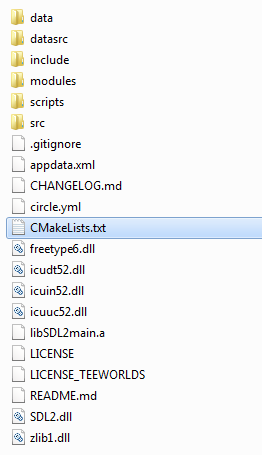
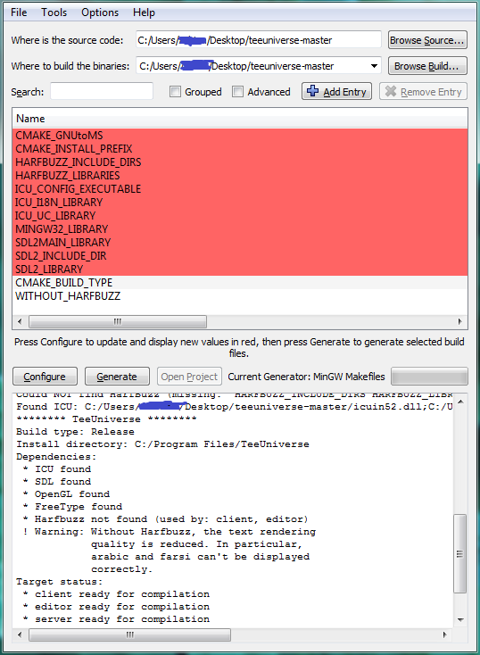

#TeeUniverse [](https://circleci.com/gh/teeuniverse/teeuniverse)

TeeUniverse is a free and open-source game offering powerful and robust support for playing online various gamemodes and playgrounds.

# Compilation (Ubuntu) #

## Installation of needed libraries ##

```
sudo apt-get install build-essential git cmake libfreetype6-dev libharfbuzz-dev libsdl2-dev libicu-dev
```

## Compilation ##

Download the sources using git:
```
git clone https://github.com/teeuniverse/teeuniverse.git
cd teeuniverse
```

Compile the project:
```
cmake .
make
```

Execute the TeeUniverse editor:
```
cd ./build/release/linux
./teeuniverse_editor
```

## Desktop integration ##

By default, all files will be installed in /usr/local, but you can change this path by running cmake and make in this way:
```
cmake . -DINSTALL_PREFIX=/my/custom/path
make
```

Install all files in your system with this command:
```
sudo make install
```

To be able to open .tup packages in TeeUniverse from your file browser, you have to execute this last command (replace /usr/local by your custom path if you decided to change it):
```
sudo ./scripts/postinstall/postinstall_linux.sh /usr/local
```

# Compilation (OSX) #

## Installation of needed libraries ##

[Follow the instructions to install MacPorts](https://www.macports.org/install.php), then install all libraries using this command:

```
sudo port install cmake git freetype harfbuzz harfbuzz-icu libsdl2 icu
```

## Compilation ##

Download the sources using git:
```
git clone https://github.com/teeuniverse/teeuniverse.git
cd teeuniverse
```

Compile the project:
```
cmake .
make
```

Execute the TeeUniverse editor:
```
cd ./build/release/osx
./teeuniverse_editor
```

# Compilation (Windows, MinGW) #

## Installation of MinGW ##

## Installation of CMake ##

Download CMake from its official webpage.
If you are using Windows 32-bit, [download this installer (official download page)](https://cmake.org/files/v3.7/cmake-3.7.1-win32-x86.msi).
If you are using Windows 64-bit, [download this installer (official download page)](https://cmake.org/files/v3.7/cmake-3.7.1-win64-x64.msi)

Execute the downloaded MSI file and install CMake.
Defaults options are fine.

## Sources and needed libraries ##

Download the sources from [GitHub (ZIP file)](https://github.com/teeuniverse/teeuniverse/archive/master.zip) and extract the content of this archive in your computer.
We will refer to this extracted directory as "TeeUniverse directory"

Download all needed libraries and sources from [the official website of TeeUniverse (ZIP file)](http://teeuniverse.net/data/teeuniverse-windows-libs.zip),
and extract the content of this archive in the TeeUniverse directory.

Your TeeUniverse directory should look like this:



## Generate the Makefile ##

Execute CMake (cmake-gui).

Click on "Browse Source..." and select the TeeUniverse directory.

Click on "Browse Build..." and select the TeeUniverse directory.

Click on "Add Entry" again, fill the "Name" field with "WITHOUT_HARFBUZZ", the "Type" field with "BOOL", keep the "Value" field empty. Click on "OK"

Click on "Configure". Check that "MinGW Makefiles" is selected and click on "Finish". Other generators maybe be possible to use, but has not been tested yet.

Click on "Generate".

Your CMake Window should look like this:



You can now close CMake.

## Compilation ##

Execute MinGW Command Prompt and type the following command to go in the TeeUniverse directory (please replace "C:\path\to\teeuniverse\directory" by your actual path to the TeeUniverse directory):
```
cd C:\path\to\teeuniverse\directory
```

Type the following command to compile TeeUniverse in 32-bit (TeeUniverse may be compatible with 64-bit compilation but was never tested. Please use this command even if you are using Windows 64-bit):
```
mingw32-make
```

Type the following command to execute TeeUniverse editor:
```
cd build\release\win
teeuniverse_editor.exe
```
